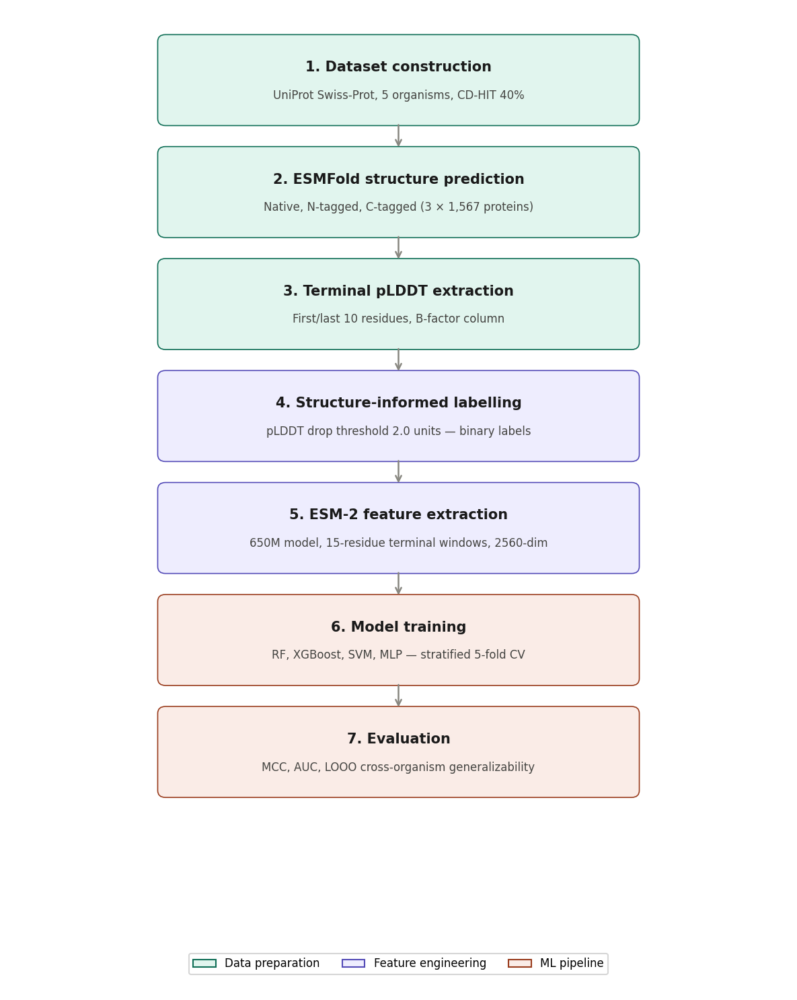

# HisTagPred

**Sequence-based prediction of optimal His-tag placement using structure-informed machine learning**

[](https://www.python.org/)
[](LICENSE)

## Overview

HisTagPred predicts whether N-terminal or C-terminal His-tag placement is preferred for a given protein sequence, using terminus-specific ESM-2 protein language model embeddings and an XGBoost classifier trained on computationally derived structural perturbation labels.



## Key Results

| Metric | 5-fold CV | LOOO (cross-organism) |
|--------|-----------|----------------------|
| MCC | 0.199 ± 0.030 | 0.108 (mean) |
| ROC-AUC | 0.634 ± 0.018 | 0.586 (mean) |
| Accuracy | 0.610 ± 0.014 | 0.568 (mean) |

## Method

1. **Dataset**: 1,567 non-redundant proteins from 5 organisms (UniProt Swiss-Prot, CD-HIT 40%)
2. **Labelling**: ESMFold structure predictions for native, N-tagged, and C-tagged variants; terminal pLDDT drop used as placement tolerance proxy
3. **Features**: ESM-2 650M terminus-specific embeddings (first/last 15 residues, 2,560 dims total)
4. **Model**: XGBoost classifier with stratified 5-fold CV

## Installation

```bash
git clone https://github.com/YOUR_USERNAME/HisTagPred.git
cd HisTagPred
pip install -r requirements.txt
```

## Quick Start

### Predict placement for a single sequence
```bash
python scripts/predict.py --sequence MKTAYIAKQRSTLVWFVKALDMQSTYRPWE
```

### Predict for a FASTA file
```bash
python scripts/predict.py --fasta my_proteins.fasta --output predictions.csv
```

### Predict for a CSV file
```bash
python scripts/predict.py --csv data/my_proteins.csv --seq_col sequence --output results.csv
```

### Re-train the model
```bash
python scripts/train.py --embeddings X_esm_float32.npy --labels y_labels.npy
```

### Extract ESM-2 embeddings
```bash
python scripts/extract_embeddings.py --input data/final_dataset.csv --output X_esm_float32.npy
```

## Repository Structure

HisTagPred/
├── data/
│   ├── final_dataset.csv          # 1,567 proteins with labels
│   └── combined_with_rmsd.csv     # Full pre-CD-HIT dataset with RMSD
├── models/
│   ├── xgboost_final.pkl          # Trained XGBoost model
│   └── scaler_final.pkl           # Fitted StandardScaler
├── notebooks/
│   ├── 01_dataset_construction.ipynb
│   ├── 02_esmfold_labelling.ipynb
│   ├── 03_esm2_embeddings.ipynb
│   ├── 04_model_training.ipynb
│   └── 05_evaluation.ipynb
├── scripts/
│   ├── predict.py
│   ├── train.py
│   └── extract_embeddings.py
└── figures/
└── pipeline.png

## Data

| File | Description | Rows |
|------|-------------|------|
| `final_dataset.csv` | CD-HIT filtered, labelled proteins | 1,567 |
| `combined_with_rmsd.csv` | Pre-filtering dataset with local RMSD | 1,984 |

### Label encoding
- `0` = C_terminal (C-terminal placement preferred)
- `1` = N_terminal (N-terminal placement preferred)

## Citation

If you use HisTagPred in your research, please cite:

## License

MIT License — see [LICENSE](LICENSE) for details.

## Contact

Muhammad Uzair Ashraf — Interdisciplinary Biotechnology Unit, Aligarh Muslim University
